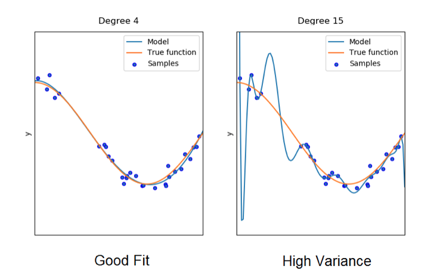
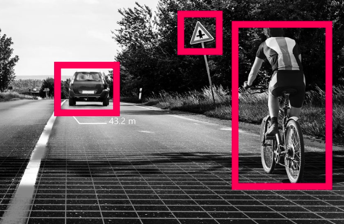

# Applications

## Deep Learning Algorithms

Deep learning is a machine learning technique that attempts to mimic the workings of the human brain in processing data for use in detecting objects, recognizing speech, translating languages, and making decisions. Overall, its goal is to teach computer what comes naturally to humans: learning by example. This requires the machine to "learn" rather than "memorize". In other words, a machine that is given training data ideally should be able to pick up on the patterns on that data without overfitting to the "noise" in the data so that the model can be successful when confronted with brand new data.

Let's look at the model on the right side of the above figure. This model fits extremely well to the data. However, it does not closely conform to the true function. Thus, the model is overfitted; it has high complexity, and picks up and "memorizes" all of the noise and random fluctuation in the data. However, if given new data derived from the same function, the model will perform very poorly, as it has not attempted to recognize the true function that describes the data. 

In contrast, the model on the left hand side of the above figure does not overfit to the data. Although the model has slightly more bias to that specefic sample of data than does the model on the right hand side, it will perform much better when faced with unseen data. It has sacrificed a little bit of present accuracy in order to learn the general pattern of the data.

## Autonomous Vehicles

In the context of deep learning, the utilization of regularization has massive implications. Let's take autonomous vehicles as an example. Autonomous vehicles use deep learning algorithms to detect various objects such as traffic signs, pedestrians, and other vehicles. Since no two of these objects that a vehicle will encounter will be exactly the same, the object detection mechanisms utilized by autonomous vehicles must use a form of regularization to ensure the safety of its passengers. A self-driving car, for example, cannot simply stop at only the stop signs it has encountered before, it must be able to recognize all stop signs, including those that may have physical defects. That is why self-driving cars use techniques such as Scale-invariant feature transform (SIFT), a feature detection algorithm that identifies local, general features in images.

## Fraud Detection

One of the main challenges in financial fraud detection is that only a very small percentage (much less than 1%) of transactions is fraud. As a consequence, it is difficult to learn how to identify fraud cases with high accuracy while maintaining low false positive rate. Additionally, there are various forms of froud that are continuously changing; Therefore, historical databases may lack the new fraud patterns. 

A solution to this that utilizes the ideas of regularization is called a "robust deep auto-encoder." This method is made to handle training data that are not clean, meaning they may contain abnormal or outlier samples. This manifests itself well to fraud detection since financial intermediaries will face many unusual purchases that usually are not fraudulent. The method works by splitting the input data X into 2 parts: X=L+S. L is efficiently reconstructed by auto-encoder and S models the noise and outlier component. Then, a minimizing regularized objective function, or loss function, is applied to both the parts.

