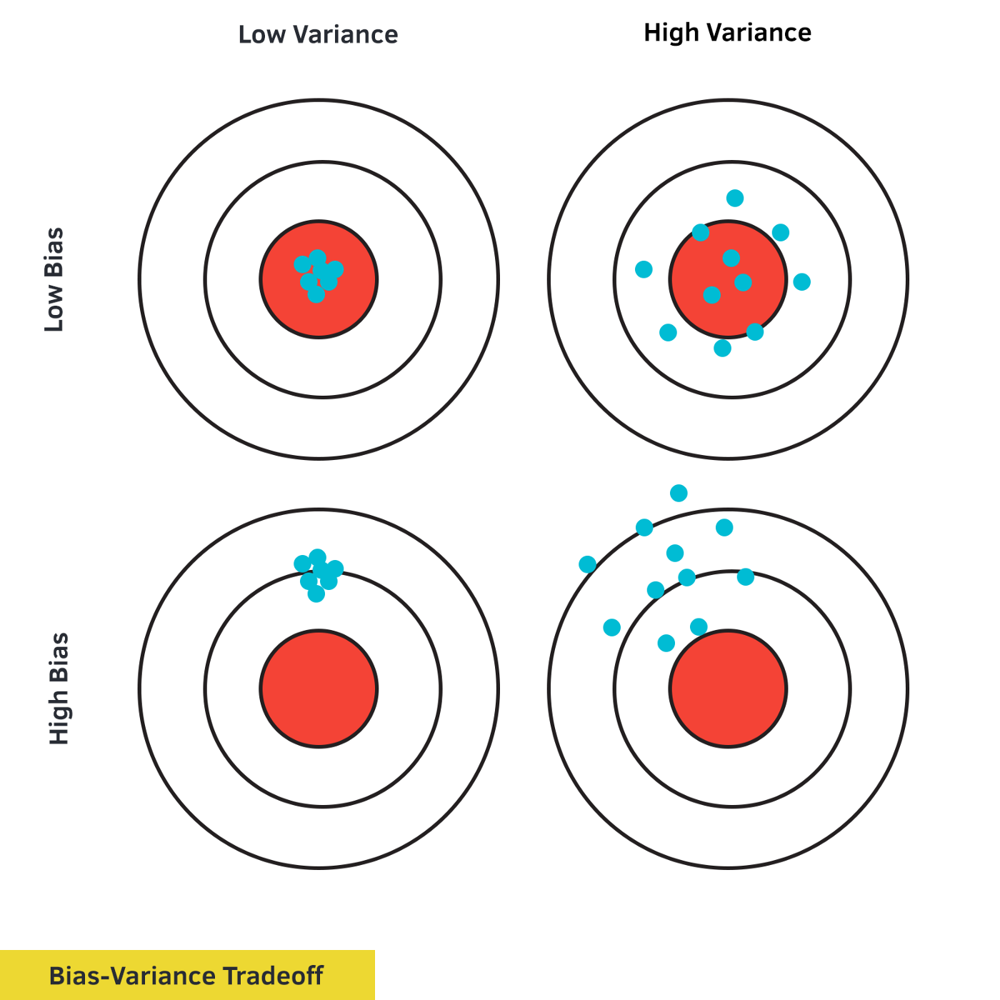

# Introduction

Linear regression is one of the most important tools in statistics, useful for both prediction and causal inference across a range of disciplines. At its core, regression is about using observed data to estimate the unknown true relationship between variables. Intuitively, this suggests two key features we might desire in  a regression model:

1. __Low Bias__: The model predicts the true relationship correctly on average

2. __Low Variance__: The predictions do not vary widely

These two features are illustrated nicely in the following figure: 

Ideally, a regression model would satisfy both of these conditions, and the estimates would look something like the bulls-eye on the top left. In many cases, however, there is a tradeoff between low bias and low variance.

Ordinary least squares, the most commonly used regression model, does well on the first of these two criteria--under reasonable assumptions, it correctly predicts the true relationship on average. However, in cases with many explanatory variables, it fails the second criteria--even though the estimates are correct _on average_ they may vary wildly depending on the specific sample of data that is used. In such cases, the OLS estimates will look like the bulls-eye on the top right in the figure above. 

In this project we consider a modification of Ordinary Least Squares, called regularization, that attempts to overcome this limitation. By penalizing large coefficients, this approach trades off unbiasedness (meaning that the model no longer makes the correct prediction on average) for less variance (meaning that a given estimate may be closer to the true value). Thus, penalized regression estimates may look more like the bulls-eye on the bottom left. 

We begin by introducing penalized regression models in section 2 and deriving the ridge estimator. Then, we present proofs of the bias and variance of ridge regression in section 3 and discuss the implications for the mean squared error. In section 4, we turn from theoretical work to simulation, showing how these estimator properties perform on real data. Finally, we consider several real world applications of these models in section 5 and conclude in section 6.
